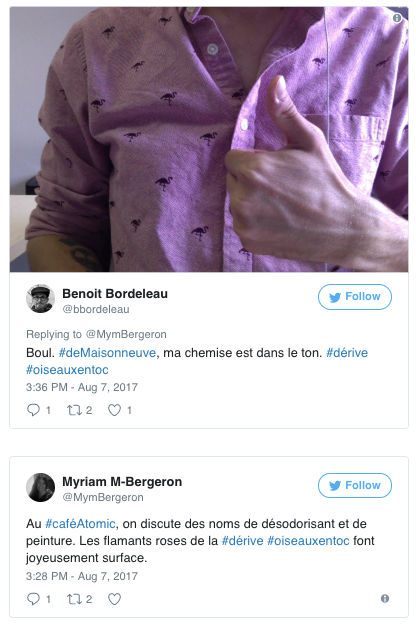

### Écrire l'espace numérique : pour une théorie littéraire de l'éditorialisation
Enrico Agostini-Marchese
 
 
_Université de Montréal_ - _CRC sur les écritures numériques_ 
 
 
FRA 6730 - Littérature et culture numérique
 
Automne 2017
 
 
26 septembre 2017

%%%%%%%%%%%%%%%%%%%%%%%%%%%%%%%%%%%%%%%%%%%%%
<!-- .slide: data-background-image="img/boussole.jpg" -->
<!-- .element: class="givemeabackground" -->

Comment penser l’espace - et la littérature - à l’ère du numérique ?

%%%%%%%%%%%%%%%%%%%%%%%%%%%%%%%%%%%%%%%%%%%%%
<!-- .slide: data-background-image="img/atlas.jpg" -->
<!-- .element: class="givemeabackground" -->

Henri Lefebvre, _La production de l'espace_, 1974, p. 49.
 
 
La sphère de l’imagination et de l’imaginaire produit un
 <i>« [e]space dominé, donc subi »</i>

§§§§§§§§§§§§§§§§§§§§§§§§§§§§§§§§§§§§§§§§§§§§§
<!-- .slide: data-background-image="img/barrage.jpg" -->
<!-- .element: class="givemeabackground" -->

Lefebvre : l'espace n'est pas un concept vide ou abstrait (mathématique, philosophie), mais partie intégrante d'un processus complexe de production.
 
 
<i>« Trialectique spatiale »</i>
 
 
Edward W. Soja, _Thirdspace: Journeys to Los Angeles and Other Real-and-Imagined Places_, 1996.

§§§§§§§§§§§§§§§§§§§§§§§§§§§§§§§§§§§§§§§§§§§§§
<!-- .slide: data-background-image="img/market.jpg" -->
<!-- .element: class="givemeabackground" -->

### Pratique spatiale

<i> « [q]ui englobe production et reproduction, lieux spécifiés et ensembles spatiaux propres à chaque formation sociale, qui assure la continuité dans une relative cohésion » </i>
 
 
H. Lefebvre, _La production de l'espace_, p. 42.

§§§§§§§§§§§§§§§§§§§§§§§§§§§§§§§§§§§§§§§§§§§§§
<!-- .slide: data-background-image="img/archi.jpg" -->
<!-- .element: class="givemeabackground" -->

### Représentations de l'espace

<i>« ... liées aux rapports de production, à l'“ordre” qu'ils imposent et par là, à des connaissances, à des signes, à des codes, à des relations “frontales” »</i>
 
 
H. Lefebvre, _La production de l'espace_, p. 43.

§§§§§§§§§§§§§§§§§§§§§§§§§§§§§§§§§§§§§§§§§§§§§
<!-- .slide: data-background-image="img/landart.png" -->
<!-- .element: class="givemeabackground" -->

### Espaces de représentation

<i> « [p]résentant (avec ou sans codage) des symbolismes complexes, liés au côté clandestin et souterrain de la vie sociale, mais aussi à l'art, qui pourrait éventuellement se définir non pas comme code de l'espace, mais comme code des espaces de représentations » </i>
 
 

H. Lefevbre, _La production de l'espace_, p. 43.

§§§§§§§§§§§§§§§§§§§§§§§§§§§§§§§§§§§§§§§§§§§§§
<!-- .slide: data-background-image="img/richter.jpg" -->
<!-- .element: class="givemeabackground" -->

### Espaces de représentation

<small>
<i> « [...] _les espaces de représentation_, c'est-à-dire l'espace vécu à travers les images et symboles qui l'accompagnent, donc espace des “habitants” et des “usagers”, mais aussi de certains artistes et peut-être de ceux qui _décrivent_ et croient seulement décrire : les écrivains, les philosophes. __C'est l'espace dominé, donc subi__, que tente de modifier et d'approprier l'imagination. Il recouvre l'espace physique en utilisant symboliquement ses objets »</i>
</small>
 
 
H. Lefevbre, _La production de l'espace_, p. 49.

%%%%%%%%%%%%%%%%%%%%%%%%%%%%%%%%%%%%%%%%%%%%%

<!-- .slide: data-background-image="img/nomos.jpg" -->
<!-- .element: class="givemeabackground" -->

### _Nomos_

Carl Schmitt _Le_ nomos _de la terre_ (1950) et _Terre et mer_ (1942).
 
 
<small><i>« Tout ordre fondamental est un ordre spatial. Parler de la constitution d’un pays ou d’un continent, c’est parler de son ordre fondamental, de son __nomos__. Or, l’ordre fondamental, le vrai, l’authentique, repose essentiellement sur certaines limites spatiales, il suppose une délimitation, une dimension, une certaine répartition de la terre. L’acte inaugural de toute grande époque est une appropriation territoriale »</small></i>

§§§§§§§§§§§§§§§§§§§§§§§§§§§§§§§§§§§§§§§§§§§§§
<!-- .slide: data-background-image="img/nomos.jpg" -->
<!-- .element: class="givemeabackground" -->

### Espace et nomos

<ul>
<li>Instances d’autorité</li>
<li>Milieu</li>
<li>Technique/technologie</li>
<li>Le symbolique et l’imaginaire</li>
</ul>

§§§§§§§§§§§§§§§§§§§§§§§§§§§§§§§§§§§§§§§§§§§§§
<!-- .slide: data-background-image="img/paturage.jpg" -->
<!-- .element: class="givemeabackground" -->

#### Instances d'autorité

§§§§§§§§§§§§§§§§§§§§§§§§§§§§§§§§§§§§§§§§§§§§§
<!-- .slide: data-background-image="img/milieu.jpg" -->

#### Milieu

§§§§§§§§§§§§§§§§§§§§§§§§§§§§§§§§§§§§§§§§§§§§§
<!-- .slide: data-background-image="img/technique.jpg" -->
<!-- .element: class="givemeabackground" -->

#### Technique et technologie

§§§§§§§§§§§§§§§§§§§§§§§§§§§§§§§§§§§§§§§§§§§§§
<!-- .slide: data-background-image="img/dante.jpg" -->
<!-- .element: class="givemeabackground" -->

#### Imaginaire et symbolique

§§§§§§§§§§§§§§§§§§§§§§§§§§§§§§§§§§§§§§§§§§§§§

<!-- .slide: data-background-image="img/edito.png" -->
<!-- .element: class="givemeabackground" -->

### Éditorialisation

 
<i>« […] l’ensemble des dynamiques qui produisent et structurent l’espace numérique. Ces dynamiques sont les interactions des actions individuelles et collectives avec un environnement numérique particulier »</i>
 
 
Marcello Vitali-Rosati, « Qu'est-ce que l'éditorialisation ? », <i>Sens Public</i>, 2016.

%%%%%%%%%%%%%%%%%%%%%%%%%%%%%%%%%%%%%%%%%%%%%
<!-- .slide: data-background-image="img/murales.jpg" -->
<!-- .element: class="givemeabackground" -->

#### Imaginer, écrire, construire la ville
 

<small>
<i>« Les images de l'environnement sont le résultat d'un processus bidirectionnel entre l'observateur et son environnement. L'environnement suggère distinctions et relations, et l'observateur [...] selectionne, organise et donne une signification à ce qu'il voit »</i>
</small>

 
 
Kevin Lynch, « L'image de la ville », 1960

§§§§§§§§§§§§§§§§§§§§§§§§§§§§§§§§§§§§§§§§§§§§§
<!-- .slide: data-background-image="img/situ.jpg" -->
<!-- .element: class="givemeabackground" -->

#### Situationnisme
 

Situation construite : « Moment de la vie, concrétement et délibérement construit par l'organisation collective d'une ambiance unitaire et d'un jeu d'événements »

§§§§§§§§§§§§§§§§§§§§§§§§§§§§§§§§§§§§§§§§§§§§§
<!-- .slide: data-background-image="img/city.jpg" -->
<!-- .element: class="givemeabackground" -->

#### Situationnisme
 

Urbanisme unitaire : « Théorie de l'emploi d'ensemble des arts et techniques concourant à la construction intégrale d'un milieu en liaison dynamique avec des expériences de comportement »

§§§§§§§§§§§§§§§§§§§§§§§§§§§§§§§§§§§§§§§§§§§§§
<!-- .slide: data-background-image="img/paris.jpg" -->
<!-- .element: class="givemeabackground" -->

#### Situationnisme
 

Dérive : « Mode de comportement expérimental lié aux conditions de la société urbaine : technique du passage hâtif à travers des ambiances variées. Se dit aussi, plus particulièrement, pour désigner la durée d'un exercice continu de cette expérience »

§§§§§§§§§§§§§§§§§§§§§§§§§§§§§§§§§§§§§§§§§§§§§
<!-- .slide: data-background-image="img/vangogh.png" -->
<!-- .element: class="givemeabackground" -->

#### Situationnisme
<small>
 
<i> « un quartier urbain n’est pas déterminé seulement par les facteurs géographiques et économiques, mais par la représentation que ses habitants et ceux des autres quartiers en ont »</i>

Chombart de Lauwe, _Paris et l’agglomération parisienne_ in Guy Debord, « Théorie de la dérive », _Internationale situationnisteé_, no. 2, décembre 1958
</small>

§§§§§§§§§§§§§§§§§§§§§§§§§§§§§§§§§§§§§§§§§§§§§
<!-- .slide: data-background-image="img/love.jpg"-->
<!-- .element: class="givemeabackground" -->

<small>

<i>« La première phase de l’amour urbain est celle cartographique : elle a lieu lorsque l’on ressent la carte de la ville aimée se superposer à n’importe quelle autre. </i>Tomber amoureux d’une ville veut dire sentir, quand on la parcourt, que les limites matérielles entre son corps et ses rues se dissolvent, quand la carte devient anatomie<i>. La deuxième phase est celle de l’</i>écriture<i>. </i>La ville prolifère dans toutes les formes possibles du signe<i>  : d’abord elle se fait prose, ensuite poésie et finalement elle devient évangile ».</i>
</small>
 
 
Paul B. Preciado, « Aimer une ville »

§§§§§§§§§§§§§§§§§§§§§§§§§§§§§§§§§§§§§§§§§§§§§
<!-- .slide: data-background-image="img/street.jpg" -->
<!-- .element: class="givemeabackground" -->

<small>
« _Marcher dans les rues comme entre les pages d’un livre_, en garder une trace, avec cet étonnement de voir, au fil du temps, _se dessiner un chemin qui n’existait pas au moment de notre trajet_. Ce dialogue n’est pas celui d’un voyage mais d’un _cheminement_, dans le bruissement, la rumeur de la ville, son quotidien et la juxtaposition ou l’_entrelacement de nos lignes de désir_ ».
</small>
 
 

Pierre Ménard, « Les lignes de désir »

§§§§§§§§§§§§§§§§§§§§§§§§§§§§§§§§§§§§§§§§§§§§§
<!-- .slide: data-background-image="img/connection.jpg" -->
<!-- .element: class="givemeabackground" -->

<small>
« En écrivant ainsi, je vois ce que le numérique change à mes propres pratiques, comment il fait déborder mon écriture vers d’autres formes que celles que j’imaginais initialement [...]. Je vois aussi que le numérique n’est pas qu’un support ou un outil, mais un _champ nouveau dans lequel nous sommes tous plongés_ ».
</small>
 
 

Cécile Portier, « (Auto)portrait »

§§§§§§§§§§§§§§§§§§§§§§§§§§§§§§§§§§§§§§§§§§§§§
<!-- .slide: data-background-image="img/naviguer.jpg" -->
<!-- .element: class="givemeabackground" -->

<small>
<i>« Le monde n’est plus lisible, il est navigable »</i>
 
 
Cécile Portier, « Étant donnée »
 
 
Notre vision de l’espace a profondément changé depuis l’avénement du web, d’internet et du numérique
 
 
<i>« Toute transformation historique implique le plus souvent une nouvelle perception de l’espace. Là se trouve le véritable noyau de la mutation globale, politique, économique et culturelle qui s’effectue alors ».</i>
 
 
Carl Schmitt, _Terre et mer_
</small>

%%%%%%%%%%%%%%%%%%%%%%%%%%%%%%%%%%%%%%%%%%%%%
<!-- .slide: data-background-image="img/img_derives.jpg" -->
<!-- .element: class="givemeabackground" -->

## Dérives

§§§§§§§§§§§§§§§§§§§§§§§§§§§§§§§§§§§§§§§§§§§§§
<!-- .slide: data-background-image="img/img_derives.jpg" -->
<!-- .element: class="givemeabackground" -->

#### 2010

<small>Noyau d’écrivaines et écrivains situés principalement à Hochelaga. Le chantier se déroulait par le mode du troc d’éléments créatifs via les sites web des auteurs.</small>

§§§§§§§§§§§§§§§§§§§§§§§§§§§§§§§§§§§§§§§§§§§§§
<!-- .slide: data-background-image="img/img_derives.jpg" -->
<!-- .element: class="givemeabackground" -->

#### 2011

<small>Des échanges papiers ainsi que numériques, via Twitter, ont été entamés.</small>

§§§§§§§§§§§§§§§§§§§§§§§§§§§§§§§§§§§§§§§§§§§§§
<!-- .slide: data-background-image="img/img_derives.jpg" -->
<!-- .element: class="givemeabackground" -->

#### 2017

<ul>
<li>#dérive</li>
<li>#nomDeLieuQuelconque</li>
</ul>

 

https://storify.com/enagmar88/derives/preview

§§§§§§§§§§§§§§§§§§§§§§§§§§§§§§§§§§§§§§§§§§§§§
<!-- .slide: data-background-image="img/img_derives.jpg" -->
<!-- .element: class="givemeabackground" -->

§§§§§§§§§§§§§§§§§§§§§§§§§§§§§§§§§§§§§§§§§§§§§
<!-- .slide: data-background-image="img/img_derives.jpg" -->
<!-- .element: class="givemeabackground" -->

§§§§§§§§§§§§§§§§§§§§§§§§§§§§§§§§§§§§§§§§§§§§§
<!-- .slide: data-background-image="img/img_derives.jpg" -->
<!-- .element: class="givemeabackground" -->

§§§§§§§§§§§§§§§§§§§§§§§§§§§§§§§§§§§§§§§§§§§§§
<!-- .slide: data-background-image="img/img_derives.jpg" -->
<!-- .element: class="givemeabackground" -->

§§§§§§§§§§§§§§§§§§§§§§§§§§§§§§§§§§§§§§§§§§§§§
<!-- .slide: data-background-image="img/img_derives.jpg" -->
<!-- .element: class="givemeabackground" -->

§§§§§§§§§§§§§§§§§§§§§§§§§§§§§§§§§§§§§§§§§§§§§
<!-- .slide: data-background-image="img/img_derives.jpg" -->
<!-- .element: class="givemeabackground" -->

§§§§§§§§§§§§§§§§§§§§§§§§§§§§§§§§§§§§§§§§§§§§§
<!-- .slide: data-background-image="img/img_derives.jpg" -->
<!-- .element: class="givemeabackground" -->

§§§§§§§§§§§§§§§§§§§§§§§§§§§§§§§§§§§§§§§§§§§§§
<!-- .slide: data-background-image="img/img_derives.jpg" -->
<!-- .element: class="givemeabackground" -->

§§§§§§§§§§§§§§§§§§§§§§§§§§§§§§§§§§§§§§§§§§§§§
<!-- .slide: data-background-image="img/img_derives.jpg" -->
<!-- .element: class="givemeabackground" -->

<i>« “Dérives rhizomatiques”, ou comment chercher à faire des liens. Trouver des hyperliens pour créer un récit, là où il n'y en a pas forcément. À force de relier des fragments recomposés, un fil pourra peut-être se tisser ».</i>
 
 
Alice Van der Klei, « sans nom »

§§§§§§§§§§§§§§§§§§§§§§§§§§§§§§§§§§§§§§§§§§§§§
<!-- .slide: data-background-image="img/img_derives.jpg" -->
<!-- .element: class="givemeabackground" -->
<small>
<i>« J'ai fini par opter pour un lieu qui n'en était pas un, ou si petit, ou si peu habitable. Du cordage à bateau recouvrait un poteau de soutènement dans le sous-sol chez mes parents. Une année, je l'ai décoré de boules, de guirlandes et de lumières, ça nous a tenu lieu de sapin de Noël. C'est le seul espace qui m'a vraiment appartenu gamine et adolescente, qu'on m'a laissé m'approprier. […] Cette </i><b>incarnation</b><i>, il me semble […] est nécessaire à la dérive ».</i>
 
 
Victoria Welby, « Nowhere » dans le cadre de la 8ème série de _Dérives_
</small>

§§§§§§§§§§§§§§§§§§§§§§§§§§§§§§§§§§§§§§§§§§§§§
<!-- .slide: data-background-image="img/img_derives.jpg" -->
<!-- .element: class="givemeabackground" -->

<i>« Dérive = réalité augmentée sans technologie. Faut ouvrir les yeux, les oreilles, les narines, la bouche, tendre les mains. Marcher dans la ville. Ou ailleurs. Ralentir. Flâner. Observer. Se laisser imprégner. Errer. Et, surtout, avoir du plaisir à le faire. Et puis écrire si le cœur nous en dit ».</i>
 
 

Pharaon Parka, « La #dérive expliquée à la génération Y »

